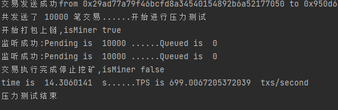

#通用测评框架beat1.0
+ 当前版本需要手动启动节点配置账户
+ 目前qps（每秒向交易池中发送的交易数）设置过高时可能出现假死现象，建议不超过50
+ 效果展示：

###启动流程：
如果不需要自定义账户信息（建议）:
- 当前目录下新建终端，执行以下命令
- `geth init --datadir data0 genesis.json   `
- `geth --datadir data0 --nodiscover --networkid 1337 --http --http.api personal,eth,net,web3,admin,miner,txpool --allow-insecure-unlock  `
- 运行main.go

如果需要自定义账户数量：（不完善，待更新）

- 注释掉main.go中的19-26行
- 启动geth
- 使用createAccount(10)创建一定的账户
- 终止geth进程
- 使用setAccountBalance(accounts)，生成新的genesis.json
- 执行`geth init --datadir data0 genesis.json   `
- 执行`geth --datadir data0 --nodiscover --networkid 1337 --http --http.api personal,eth,net,web3,admin,miner,txpool --allow-insecure-unlock  `
- 取消掉19-26行的注释，并注释掉createAccount(10)与setAccountBalance(accounts)
- 运行main.go